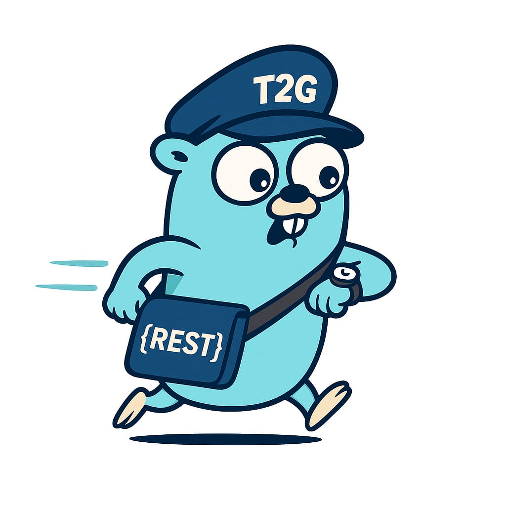

<p align="center">
  
</p>

<h1 align="center">Time2Go</h1>
<p align="center">⏱️ Time-based event scheduler with HTTP trigger and retry mechanism</p>

# Time2Go

**Time2Go** is a lightweight time-based event scheduling system that automatically executes HTTP requests. It's ideal for recurring API triggers, delayed webhooks, or automated reminders. Time2Go supports retry policies, basic authentication, and temporary storage using Redis.

## 🚀 Key Features

- ⏰ Schedule HTTP requests at a specific time (`RFC3339` format)
- 🔁 Retry policy support (Fixed and Exponential Backoff)
- 🔐 Basic Auth support
- 💾 Distributed event storage with Redis
- 📡 Automatic HTTP execution with full support for headers, query parameters, body, and timeout

---

## 📦 Event Configuration Structure (JSON)

```json
{
  "client_name": "client-1",
  "event_name": "send-webhook",
  "event_id": "uuid-1234",
  "schedule_at": "2025-05-24T13:10:00+07:00",
  "status": "PENDING",
  "last_error": "",
  "request_config": {
    "method": "POST",
    "url": "https://webhook.site/your-endpoint",
    "headers": {
      "Content-Type": "application/json"
    },
    "query_params": {
      "source": "time2go"
    },
    "body": "eyJtZXNzYWdlIjogIlRpbWUgdG8gR08ifQ==",
    "timeout": "10s",
    "auth": {
      "username": "myuser",
      "password": "mypassword"
    }
  },
  "retry_policy": {
    "type": 1,
    "retry_count": 5,
    "max_attempts": 5,
    "attempt_count": 0
  }
}
```

### 🔁 Retry Policy Type

| Type | Name                | description                                                               |
| ---- | ------------------- | ------------------------------------------------------------------------- |
| 1    | Fixed Delay         | Retries will be attempted every retry_count seconds                       |
| 2    | Exponential Backoff | Delay increases exponentially: base \* 2^n where n is the current attempt |
