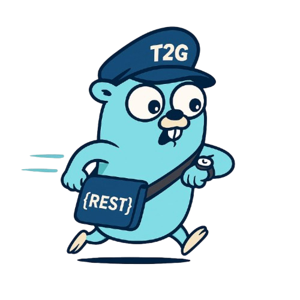

<table style="border: none;">
   <tr>
      <td width=30%>
         <p align="center">
            
         </p>
      </td>
      <td>
         <h1 align="left">Time2Go</h1>
         <p align="left">⏱️ Time-based event scheduler with HTTP trigger and retry mechanism</p>
      </td>
   </tr>
</table>

[](https://golang.org)
[](https://redis.io)
[](https://grpc.io)
[](LICENSE)

**Time2Go** is a production-ready, lightweight time-based event scheduling system that automatically executes HTTP requests at specified times. Built with Go and Redis, it's designed for high availability, horizontal scalability, and reliability.

Perfect for recurring API triggers, delayed webhooks, automated reminders, scheduled notifications, and integration workflows.

---

## 📋 Table of Contents

- [Features](#-features)
- [Architecture](#-architecture)
- [Prerequisites](#-prerequisites)
- [Quick Start](#-quick-start)
- [Installation](#-installation)
- [Configuration](#-configuration)
- [API Documentation](#-api-documentation)
- [Usage Examples](#-usage-examples)
- [Deployment](#-deployment)
- [Development](#-development)
- [Monitoring](#-monitoring)
- [Troubleshooting](#-troubleshooting)
- [Contributing](#-contributing)
- [License](#-license)

---

## 🚀 Features

- ⏰ **Precise Time-based Scheduling** - Schedule HTTP requests at specific times using `RFC3339` format with timezone support
- 🔁 **Smart Retry Policies** - Built-in retry mechanisms with Fixed Delay and Exponential Backoff strategies
- 🔐 **Authentication Support** - HTTP Basic Auth integration for secure API calls
- 💾 **Distributed Architecture** - Redis-backed event storage for high availability and horizontal scaling
- 📡 **Full HTTP Support** - Complete control over HTTP requests including custom headers, query parameters, body payload, and configurable timeouts
- 🎯 **Dual Protocol Support** - Accessible via both gRPC and REST APIs
- 📊 **Production Monitoring** - Built-in Elastic APM integration and Prometheus metrics
- 🔒 **Distributed Locking** - Prevents duplicate event execution in multi-instance deployments
- ⚡ **High Performance** - Efficient event listener with minimal resource footprint
- 🛡️ **Graceful Shutdown** - Safe shutdown mechanism ensuring no event loss

---

## 🏗️ Architecture

```
┌─────────────────────────────────────────────────────────────┐
│                        Clients                               │
│                    (REST / gRPC)                             │
└──────────────────┬──────────────────────────────────────────┘
                   │
                   ▼
┌─────────────────────────────────────────────────────────────┐
│                      Time2Go Server                          │
│  ┌────────────┐  ┌────────────┐  ┌────────────────────┐   │
│  │ REST API   │  │ gRPC API   │  │ Event Listener     │   │
│  │ (Gateway)  │  │ (Native)   │  │ (Background Worker)│   │
│  └─────┬──────┘  └─────┬──────┘  └──────────┬─────────┘   │
│        │               │                     │              │
│        └───────────────┴─────────────────────┘              │
│                        │                                     │
│                        ▼                                     │
│               ┌─────────────────┐                           │
│               │    Use Case     │                           │
│               │  (Business      │                           │
│               │   Logic)        │                           │
│               └────────┬────────┘                           │
│                        │                                     │
│                        ▼                                     │
│               ┌─────────────────┐                           │
│               │   Repository    │                           │
│               │  (Data Access)  │                           │
│               └────────┬────────┘                           │
└────────────────────────┼─────────────────────────────────────┘
                         │
                         ▼
              ┌──────────────────────┐
              │       Redis          │
              │  ┌────────────────┐  │
              │  │ Event Index    │  │
              │  │ Trigger Time   │  │
              │  │ Event Data     │  │
              │  │ Lock Keys      │  │
              │  └────────────────┘  │
              └──────────────────────┘
                         │
                         │ (When scheduled time arrives)
                         ▼
              ┌──────────────────────┐
              │  Target HTTP API     │
              │  (Your Webhook/API)  │
              └──────────────────────┘
```

### How It Works

1. **Event Creation**: Client creates an event via REST or gRPC API with schedule time and HTTP configuration
2. **Storage**: Event is stored in Redis with indexed keys for efficient retrieval
3. **Monitoring**: Event Listener continuously polls Redis for events reaching their scheduled time
4. **Execution**: When time arrives, Event Listener executes the HTTP request with configured parameters
5. **Retry Logic**: If request fails, retry policy is applied (Fixed or Exponential Backoff)
6. **Completion**: Event status is updated to SUCCESS or FAILED after max attempts

---

## 📦 Prerequisites

Before you begin, ensure you have the following installed:

- **Go** 1.23 or higher ([Download](https://golang.org/dl/))
- **Redis** 7.0 or higher ([Download](https://redis.io/download))
- **Git** for version control
- **Make** (optional, for convenience commands)

### System Requirements

- **CPU**: 1+ cores
- **RAM**: 512MB+ (recommended 1GB for production)
- **Storage**: 100MB for application, additional for Redis data
- **Network**: Outbound HTTP/HTTPS access for webhook execution

---

## ⚡ Quick Start

Get Time2Go up and running in 3 minutes:

### 1. Clone and Setup

```bash
# Clone the repository
git clone https://github.com/LukmanulHakim18/time2go.git
cd time2go

# Install dependencies
go mod download
```

### 2. Start Redis

```bash
# Using Docker Compose (Recommended)
docker-compose up -d

# Or using local Redis
redis-server
```

### 3. Configure Environment

```bash
# Copy environment template
cp .env.example .env

# Edit configuration (use your preferred editor)
nano .env
```

### 4. Run the Application

```bash
# Development mode
go run main.go

# Or build and run
go build -o time2go
./time2go
```

**That's it!** Time2Go is now running on:
- **gRPC**: `localhost:50051`
- **REST API**: `localhost:8080`
- **Metrics**: `localhost:8080/metrics`

---

## 🔧 Installation

### From Source

```bash
# 1. Clone repository
git clone https://github.com/LukmanulHakim18/time2go.git
cd time2go

# 2. Install Go dependencies
go mod download

# 3. Build the binary
go build -o time2go main.go

# 4. Run
./time2go
```

### Using Docker (Coming Soon)

```bash
# Pull the image
docker pull lukmanulhakim18/time2go:latest

# Run with docker-compose
docker-compose up -d
```

### Binary Release (Coming Soon)

Download pre-built binaries from [Releases](https://github.com/LukmanulHakim18/time2go/releases) page.

---

## ⚙️ Configuration

Time2Go uses environment variables for configuration. Create a `.env` file in the project root:

### Required Configuration

```bash
# Application
APP_NAME=time2go
APP_PORT=8080
GRPC_PORT=50051

# Redis
REDIS_HOST=localhost
REDIS_PORT=6379
REDIS_PASSWORD=
REDIS_DB=0

# Event Listener
LISTENER_INTERVAL=1s          # How often to check for due events
LISTENER_BATCH_SIZE=100       # Max events to process per batch
```

### Optional Configuration

```bash
# Elastic APM (for monitoring)
ELASTIC_APM_SERVER_URL=http://localhost:8200
ELASTIC_APM_SERVICE_NAME=time2go
ELASTIC_APM_ENVIRONMENT=development
ELASTIC_APM_ACTIVE=false

# Logging
LOG_LEVEL=info                # debug, info, warn, error
LOG_FORMAT=json               # json or text

# Timeouts
HTTP_CLIENT_TIMEOUT=30s       # Default timeout for webhook calls
SHUTDOWN_TIMEOUT=5s           # Graceful shutdown timeout
```

For complete configuration options, see [`.env.example`](.env.example)

---

## 📡 API Documentation

Time2Go exposes both REST and gRPC APIs for maximum flexibility.

### REST API Endpoints

Base URL: `http://localhost:8080`

#### Create Event

Schedule a new HTTP request execution.

**Endpoint**: `POST /api/v1/event`

**Request Body**:
```json
{
  "client_name": "my-service",
  "event_name": "send-notification",
  "event_id": "evt-001",
  "schedule_at": "2025-11-03T15:30:00+07:00",
  "status": "PENDING",
  "request_config": {
    "method": "POST",
    "url": "https://webhook.site/your-endpoint",
    "headers": {
      "Content-Type": "application/json",
      "X-Custom-Header": "value"
    },
    "query_params": {
      "source": "time2go",
      "priority": "high"
    },
    "body": "eyJtZXNzYWdlIjogIkhlbGxvIFdvcmxkIn0=",
    "timeout": "10s",
    "auth": {
      "username": "api_user",
      "password": "api_password"
    }
  },
  "retry_policy": {
    "type": 1,
    "retry_count": 5,
    "max_attempts": 5,
    "attempt_count": 0
  }
}
```

**Response**:
```json
{
  "code": "200",
  "message": "Event created successfully"
}
```

#### Health Check

Check if the service is running.

**Endpoint**: `GET /api/v1/health`

**Response**:
```json
{
  "code": "200",
  "message": "OK"
}
```

### gRPC API

Proto definition available at [`contract/time2go.proto`](contract/time2go.proto)

**Service**: `EventScheduler`

**Methods**:
- `SetEvent(Event)` - Create a new scheduled event
- `HealthCheck(EmptyRequest)` - Check service health

### Field Descriptions

| Field | Type | Required | Description |
|-------|------|----------|-------------|
| `client_name` | string | Yes | Identifier for the client/service creating the event |
| `event_name` | string | Yes | Name/type of the event |
| `event_id` | string | Yes | Unique identifier for this event (must be unique) |
| `schedule_at` | string | Yes | RFC3339 timestamp with timezone (e.g., "2025-11-03T15:30:00+07:00") |
| `status` | string | No | Initial status (default: "PENDING") |
| `request_config.method` | string | Yes | HTTP method (GET, POST, PUT, DELETE, PATCH, etc.) |
| `request_config.url` | string | Yes | Target URL to call |
| `request_config.headers` | map | No | Custom HTTP headers |
| `request_config.query_params` | map | No | URL query parameters |
| `request_config.body` | bytes | No | Request body (base64 encoded for REST API) |
| `request_config.timeout` | string | No | Request timeout (e.g., "10s", "30s") - default: 30s |
| `request_config.auth` | object | No | Basic authentication credentials |
| `retry_policy.type` | int | Yes | 1=Fixed Delay, 2=Exponential Backoff |
| `retry_policy.retry_count` | int | Yes | For Fixed: seconds between retries. For Exponential: base multiplier |
| `retry_policy.max_attempts` | int | Yes | Maximum number of retry attempts |

### Retry Policy Types

| Type | Value | Behavior | Example |
|------|-------|----------|---------|  
| **Fixed Delay** | 1 | Retries with constant interval | `retry_count=5` → retry every 5 seconds |
| **Exponential Backoff** | 2 | Delay increases exponentially | `retry_count=2` → 2s, 4s, 8s, 16s, 32s |

**Formula for Exponential Backoff**: `delay = base * 2^attempt`

---

## 💡 Usage Examples

### Example 1: Simple Webhook Call

Schedule a webhook to be called in 1 hour:

```bash
curl -X POST http://localhost:8080/api/v1/event \
  -H "Content-Type: application/json" \
  -d '{
    "client_name": "notification-service",
    "event_name": "send-email",
    "event_id": "email-12345",
    "schedule_at": "2025-11-03T16:00:00+07:00",
    "request_config": {
      "method": "POST",
      "url": "https://api.example.com/send-email",
      "headers": {
        "Content-Type": "application/json"
      },
      "body": "eyJ0byI6ICJ1c2VyQGV4YW1wbGUuY29tIiwgInN1YmplY3QiOiAiUmVtaW5kZXIifQ=="
    },
    "retry_policy": {
      "type": 1,
      "retry_count": 5,
      "max_attempts": 3
    }
  }'
```

### Example 2: Authenticated API Call with Exponential Backoff

```bash
curl -X POST http://localhost:8080/api/v1/event \
  -H "Content-Type: application/json" \
  -d '{
    "client_name": "payment-service",
    "event_name": "retry-payment",
    "event_id": "pay-67890",
    "schedule_at": "2025-11-03T14:30:00Z",
    "request_config": {
      "method": "POST",
      "url": "https://api.payment.com/process",
      "headers": {
        "Content-Type": "application/json",
        "X-API-Key": "secret-key"
      },
      "body": "eyJhbW91bnQiOiAxMDAsICJjdXJyZW5jeSI6ICJVU0QifQ==",
      "timeout": "30s",
      "auth": {
        "username": "merchant_123",
        "password": "secret_password"
      }
    },
    "retry_policy": {
      "type": 2,
      "retry_count": 2,
      "max_attempts": 5
    }
  }'
```

This will retry with delays: 2s → 4s → 8s → 16s → 32s

### Example 3: GET Request with Query Parameters

```bash
curl -X POST http://localhost:8080/api/v1/event \
  -H "Content-Type: application/json" \
  -d '{
    "client_name": "monitoring-service",
    "event_name": "health-check",
    "event_id": "hc-11111",
    "schedule_at": "2025-11-03T15:00:00+07:00",
    "request_config": {
      "method": "GET",
      "url": "https://api.external.com/status",
      "query_params": {
        "service": "database",
        "region": "asia-southeast"
      },
      "timeout": "10s"
    },
    "retry_policy": {
      "type": 1,
      "retry_count": 3,
      "max_attempts": 2
    }
  }'
```

### Example 4: Using gRPC (Go Client)

```go
package main

import (
    "context"
    "log"
    "time"
    
    "github.com/LukmanulHakim18/time2go/contract"
    "google.golang.org/grpc"
)

func main() {
    // Connect to gRPC server
    conn, err := grpc.Dial("localhost:50051", grpc.WithInsecure())
    if err != nil {
        log.Fatalf("Failed to connect: %v", err)
    }
    defer conn.Close()
    
    client := contract.NewEventSchedulerClient(conn)
    
    // Create event
    event := &contract.Event{
        ClientName: "my-app",
        EventName:  "scheduled-task",
        EventId:    "task-001",
        ScheduleAt: time.Now().Add(1 * time.Hour).Format(time.RFC3339),
        RequestConfig: &contract.HTTPRequestConfig{
            Method: "POST",
            Url:    "https://webhook.site/your-endpoint",
            Headers: map[string]string{
                "Content-Type": "application/json",
            },
            Body:    []byte(`{"message": "Hello from gRPC"}`),
            Timeout: "10s",
        },
        RetryPolicy: &contract.RetryPolicy{
            Type:        contract.RetryPolicyType_FIXED,
            RetryCount:  5,
            MaxAttempts: 3,
        },
    }
    
    resp, err := client.SetEvent(context.Background(), event)
    if err != nil {
        log.Fatalf("Error: %v", err)
    }
    
    log.Printf("Response: %s - %s", resp.Code, resp.Message)
}
```

### Base64 Encoding Request Body

If you need to encode a JSON payload for the `body` field:

```bash
# Using base64 command
echo -n '{"message": "Hello World"}' | base64
# Output: eyJtZXNzYWdlIjogIkhlbGxvIFdvcmxkIn0=

# Using Python
python3 -c "import base64; print(base64.b64encode(b'{\"message\": \"Hello World\"}').decode())"

# Using Node.js
node -e "console.log(Buffer.from('{\"message\": \"Hello World\"}').toString('base64'))"
```

---

## 🚀 Deployment

### Docker Deployment

1. **Create Dockerfile** (save as `Dockerfile` in project root):

```dockerfile
FROM golang:1.23-alpine AS builder

WORKDIR /app
COPY go.mod go.sum ./
RUN go mod download

COPY . .
RUN CGO_ENABLED=0 GOOS=linux go build -a -installsuffix cgo -o time2go .

FROM alpine:latest
RUN apk --no-cache add ca-certificates
WORKDIR /root/
COPY --from=builder /app/time2go .
COPY --from=builder /app/.env .

EXPOSE 8080 50051
CMD ["./time2go"]
```

2. **Build and run**:

```bash
# Build image
docker build -t time2go:latest .

# Run with docker-compose
docker-compose up -d
```

3. **Production docker-compose.yaml**:

```yaml
version: "3.8"

services:
  redis:
    image: redis:7-alpine
    container_name: time2go-redis
    ports:
      - "6379:6379"
    volumes:
      - redis_data:/data
    command: redis-server --appendonly yes
    restart: unless-stopped
    healthcheck:
      test: ["CMD", "redis-cli", "ping"]
      interval: 10s
      timeout: 3s
      retries: 3

  time2go:
    build: .
    container_name: time2go-app
    ports:
      - "8080:8080"
      - "50051:50051"
    environment:
      - REDIS_HOST=redis
      - REDIS_PORT=6379
      - APP_PORT=8080
      - GRPC_PORT=50051
    depends_on:
      redis:
        condition: service_healthy
    restart: unless-stopped
    healthcheck:
      test: ["CMD", "wget", "--no-verbose", "--tries=1", "--spider", "http://localhost:8080/api/v1/health"]
      interval: 30s
      timeout: 10s
      retries: 3

volumes:
  redis_data:
```

### Kubernetes Deployment (Example)

See [`deployment/kubernetes/`](deployment/kubernetes/) for complete manifests.

```bash
# Apply configurations
kubectl apply -f deployment/kubernetes/

# Check status
kubectl get pods -l app=time2go
```

### Systemd Service (Linux)

Create `/etc/systemd/system/time2go.service`:

```ini
[Unit]
Description=Time2Go Event Scheduler
After=network.target redis.service

[Service]
Type=simple
User=time2go
WorkingDirectory=/opt/time2go
ExecStart=/opt/time2go/time2go
Restart=always
RestartSec=10

[Install]
WantedBy=multi-user.target
```

Enable and start:

```bash
sudo systemctl enable time2go
sudo systemctl start time2go
sudo systemctl status time2go
```

---

## 🛠️ Development

### Project Structure

```
time2go/
├── config/              # Configuration loaders
├── constant/            # Application constants
├── contract/            # gRPC proto files and generated code
├── model/               # Domain models
├── pkg/                 # Shared packages
│   └── eventListener/   # Event listener implementation
├── repository/          # Data access layer
├── server/              # Server initialization (gRPC & REST)
├── transport/           # API handlers
├── usecase/             # Business logic
├── util/                # Utility functions
├── main.go              # Application entry point
├── go.mod               # Go dependencies
└── docker-compose.yaml  # Docker compose for Redis
```

### Running Tests

```bash
# Run all tests
go test ./...

# Run with coverage
go test -cover ./...

# Generate coverage report
go test -coverprofile=coverage.out ./...
go tool cover -html=coverage.out
```

### Code Generation

Time2Go uses Protocol Buffers for gRPC. To regenerate code after modifying `.proto` files:

```bash
# Install protoc plugins
go install google.golang.org/protobuf/cmd/protoc-gen-go@latest
go install google.golang.org/grpc/cmd/protoc-gen-go-grpc@latest

# Generate code
protoc --go_out=. --go_opt=paths=source_relative \
    --go-grpc_out=. --go-grpc_opt=paths=source_relative \
    contract/time2go.proto
```

### Local Development Setup

```bash
# 1. Install development dependencies
go install github.com/golangci/golangci-lint/cmd/golangci-lint@latest

# 2. Run linter
golangci-lint run

# 3. Format code
go fmt ./...

# 4. Run with hot reload (install air first)
go install github.com/cosmtrek/air@latest
air
```

---

## 📊 Monitoring

### Prometheus Metrics

Time2Go exposes metrics at `/metrics` endpoint (default: `http://localhost:8080/metrics`)

**Available Metrics**:
- `time2go_events_created_total` - Total events created
- `time2go_events_executed_total` - Total events executed
- `time2go_events_failed_total` - Total events failed
- `time2go_event_execution_duration_seconds` - Histogram of execution durations
- `time2go_active_events` - Current number of pending events

### Elastic APM Integration

Time2Go has built-in Elastic APM support for distributed tracing and performance monitoring.

Configure in `.env`:
```bash
ELASTIC_APM_SERVER_URL=http://your-apm-server:8200
ELASTIC_APM_SERVICE_NAME=time2go
ELASTIC_APM_ENVIRONMENT=production
ELASTIC_APM_ACTIVE=true
```

### Health Checks

```bash
# HTTP health check
curl http://localhost:8080/api/v1/health

# Response
{
  "code": "200",
  "message": "OK"
}
```

### Logging

Time2Go uses structured JSON logging. Configure log level:

```bash
LOG_LEVEL=debug  # debug, info, warn, error
LOG_FORMAT=json  # json or text
```

---

## 🔍 Troubleshooting

### Common Issues

#### 1. Connection refused to Redis

**Problem**: `dial tcp 127.0.0.1:6379: connect: connection refused`

**Solution**:
```bash
# Check if Redis is running
redis-cli ping
# Should return: PONG

# If not running, start Redis
docker-compose up -d redis
# OR
redis-server
```

#### 2. Event not executing at scheduled time

**Problem**: Event remains in PENDING status past schedule time

**Possible Causes**:
- Event Listener not running (check logs)
- Schedule time in the past
- Redis connection issues

**Solution**:
```bash
# Check application logs
docker logs time2go-app

# Verify schedule time format
# Correct: "2025-11-03T15:30:00+07:00"
# Wrong: "2025-11-03 15:30:00" (missing timezone)

# Check Event Listener is running
curl http://localhost:8080/api/v1/health
```

#### 3. HTTP request failing with timeout

**Problem**: Events failing with timeout errors

**Solution**:
```bash
# Increase timeout in request_config
"timeout": "60s"  # Instead of default 30s

# Check if target URL is accessible
curl -I https://target-url.com
```

#### 4. Too many retries causing delays

**Problem**: Exponential backoff causing very long delays

**Solution**:
- Reduce `max_attempts`
- Use Fixed Delay instead of Exponential for faster retries
- Adjust `retry_count` for Exponential to lower base value

```json
{
  "retry_policy": {
    "type": 1,        // Use Fixed instead of Exponential
    "retry_count": 5, // 5 seconds between retries
    "max_attempts": 3 // Only retry 3 times
  }
}
```

#### 5. Duplicate event execution

**Problem**: Same event executing multiple times

**Cause**: Multiple Time2Go instances without proper locking

**Solution**: Ensure Redis is properly configured. Time2Go uses distributed locks to prevent duplicates.

### Debug Mode

Enable debug logging:

```bash
export LOG_LEVEL=debug
./time2go
```

### Getting Help

If you're still experiencing issues:

1. Check [existing issues](https://github.com/LukmanulHakim18/time2go/issues)
2. Create a [new issue](https://github.com/LukmanulHakim18/time2go/issues/new) with:
   - Time2Go version
   - Go version
   - Redis version
   - Error logs
   - Steps to reproduce

---

## 🤝 Contributing

We welcome contributions! Please see [CONTRIBUTING.md](CONTRIBUTING.md) for details.

### Quick Start for Contributors

1. Fork the repository
2. Create your feature branch (`git checkout -b feature/amazing-feature`)
3. Commit your changes (`git commit -m 'Add some amazing feature'`)
4. Push to the branch (`git push origin feature/amazing-feature`)
5. Open a Pull Request

### Development Guidelines

- Write tests for new features
- Follow Go code conventions
- Update documentation
- Keep commits atomic and well-described

---

## 📄 License

This project is licensed under the MIT License - see the [LICENSE](LICENSE) file for details.

---

## 🙏 Acknowledgments

- Built with [Go](https://golang.org/)
- Powered by [Redis](https://redis.io/)
- Uses [gRPC](https://grpc.io/) for efficient communication
- Monitored with [Elastic APM](https://www.elastic.co/apm) and [Prometheus](https://prometheus.io/)

---

## 📞 Support

- 📧 Email: lukmanulhakim.dev@gmail.com
- 🐛 Issues: [GitHub Issues](https://github.com/LukmanulHakim18/time2go/issues)
- 💬 Discussions: [GitHub Discussions](https://github.com/LukmanulHakim18/time2go/discussions)

---

<p align="center">Made with ❤️ by <a href="https://github.com/LukmanulHakim18">Lukmanul Hakim</a></p>